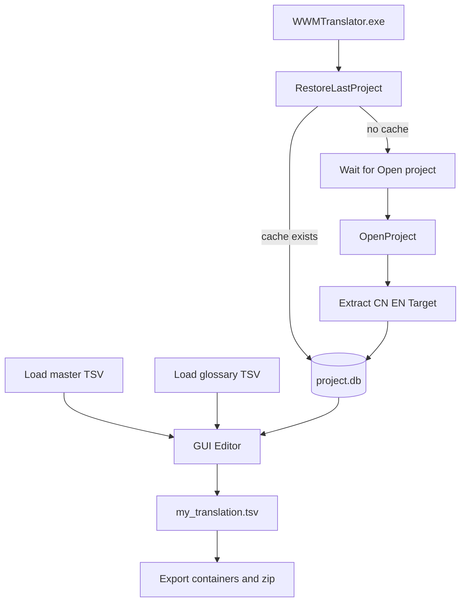

# Архитектура standalone-инструмента

## Компоненты

- `project.py` — проектные пути и каталог данных.
- `base.py` — распаковка и агрегация locale-контейнеров в `cn.tsv`, `en.tsv`, `target.tsv`.
- `db.py` — схема БД `strings/tm/glossary/qa_issues` для целевого языка.
- `gui/` — редактор, фильтры, TM, QA, Same Source, Rendered Preview и Notes.
- `build.py` — экспорт обновлённых locale-контейнеров и zip.

## Хранение данных

В exe-режиме данные всегда создаются рядом с программой:

- `WWMTranslator/data/projects/<game_slug>_<lang>/project.db`
- `WWMTranslator/data/projects/<game_slug>_<lang>/my_translation.tsv`
- `WWMTranslator/data/projects/<game_slug>_<lang>/project.json`

## Слои перевода

- `target_official` — официальный текст из файлов игры.
- `master` — внешний TSV, загруженный из меню Project.
- `mine` — локальные пользовательские правки в `my_translation.tsv`.

Статусы (`new`, `master`, `changed`, `outdated`, `approved`, `rejected`, `official_match`)
вычисляются на основе `cn_hash`, review-меток и сравнения слоёв.
