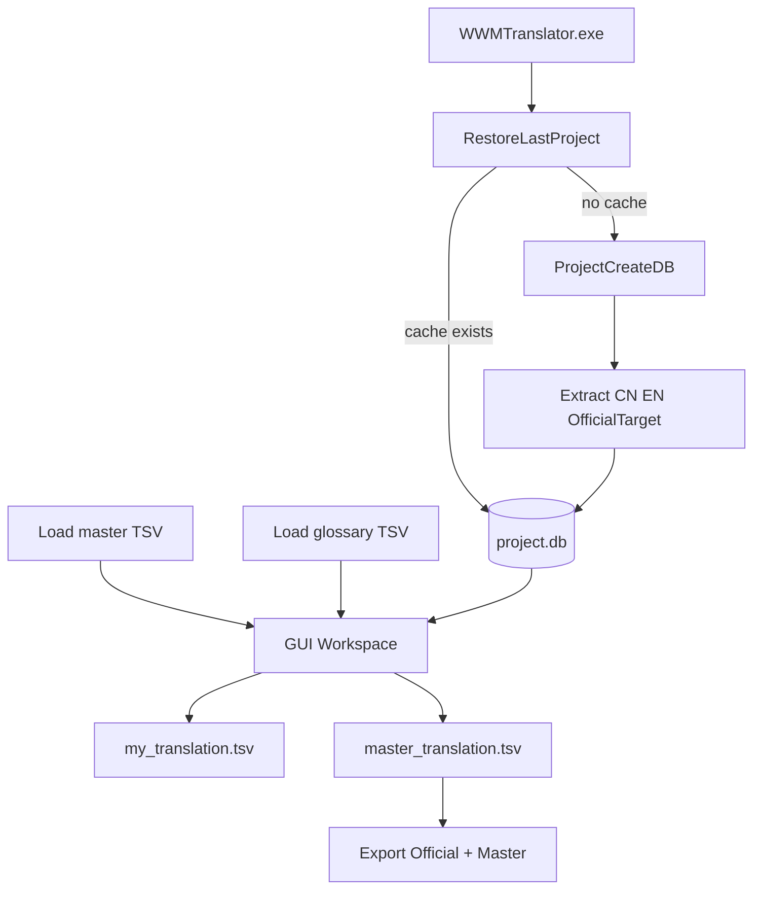

# Architecture

## High-level flow

## Main modules

- `project.py`  
  Project paths, metadata, recent project tracking.
- `base.py`  
  Locale extraction pipeline from game containers.
- `db.py`  
  SQLite schema and cache rebuild (`strings`, `qa_issues`, `tm`, `glossary`, FTS).
- `overlay.py`  
  TSV parsing/writing, merge rules for master and personal layers.
- `qa.py`  
  Row QA, full QA run, export QA run, conflict checks.
- `tm.py`  
  Translation memory build and candidate retrieval.
- `gui/`  
  Table model, editor workflow, side panels, actions, async workers.
- `build.py`  
  Container rewrite and release package generation.

## Data model and layers

- `target_official`  
  Official target text from game files (reference base).
- `master overlay`  
  Trusted saved overrides (TSV), applied on export.
- `my overlay`  
  Personal working layer (TSV), editable and reviewable.

Only `my` is directly edited in GUI.  
`master` is updated via `Save master translation` from approved rows.

## Review and state resolution

Core state resolution is in `StringsRepository.resolve_overlay()`:

- `outdated` on `cn_hash` mismatch (CN changed).
- `approved` / `rejected` from personal review states.
- auto-approved when `My == Master`.
- `official_match` when `My == Official` and differs from `Master`.
- fallback states: `new`, `changed`, `master`, `official`, `untranslated`.

Master overlay states are normalized so review states remain personal-only.

## QA architecture

- `Run QA` runs in a background worker thread (`QAWorker`) to avoid UI freezes.
- QA writes to `qa_issues` and supports:
  - placeholders
  - link-tag count integrity
  - glossary strict term coverage
  - render-parser warnings
  - same-CN multi-target conflicts
- QA tab supports row mode and project overview mode with click-to-jump navigation.

## Rendered preview parser

`render_preview.py` interprets game-style formatting:

- color tags: `#Y...#E`, `#G...#E`, `#RRGGBB...#E`
- escaped markers: `\n`, `/n`, `/w`, etc.
- placeholders: `{...}`
- dollar variables: `$...$`
- conditional markers: `$S` / `$E`
- nested link tags with technical payload stripping for user-visible text.

## Storage and runtime

In exe mode, all project data is stored near executable:

- `WWMTranslator/data/projects/<game_slug>_<lang>/project.db`
- `WWMTranslator/data/projects/<game_slug>_<lang>/my_translation.tsv`
- `WWMTranslator/data/projects/<game_slug>_<lang>/project.json`
